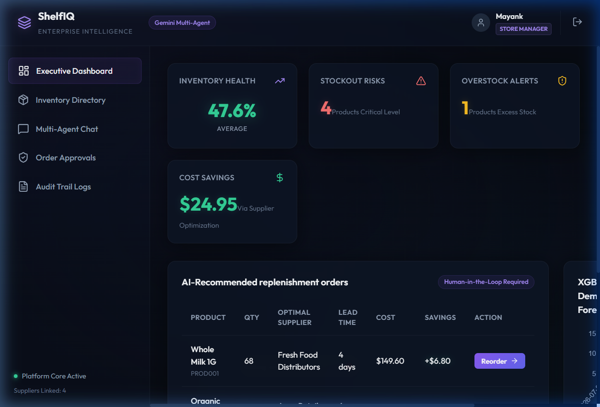
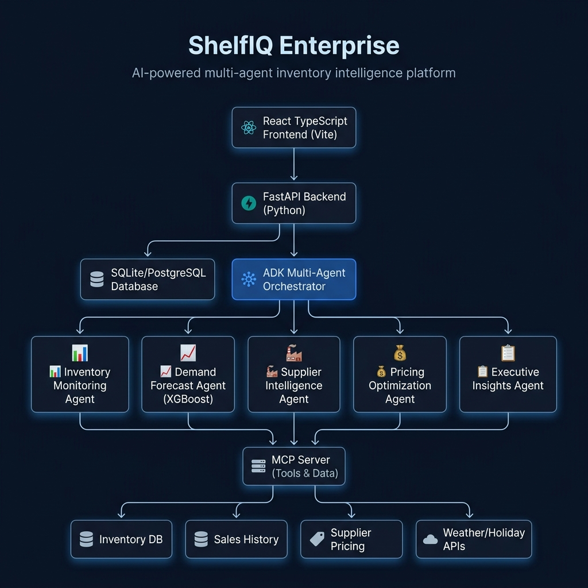
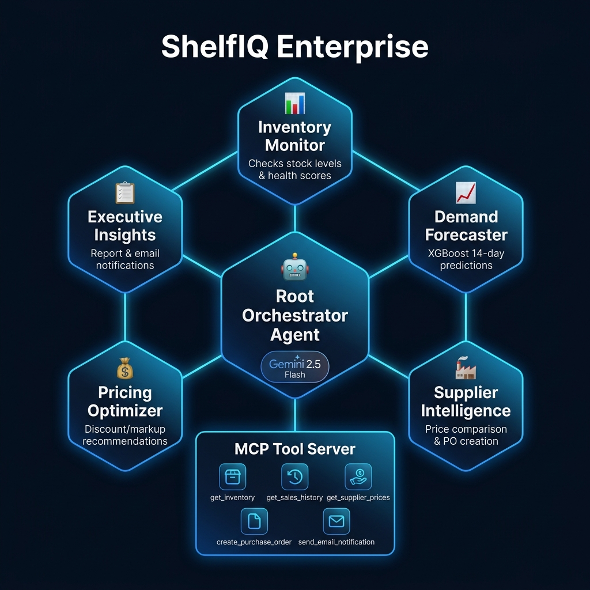
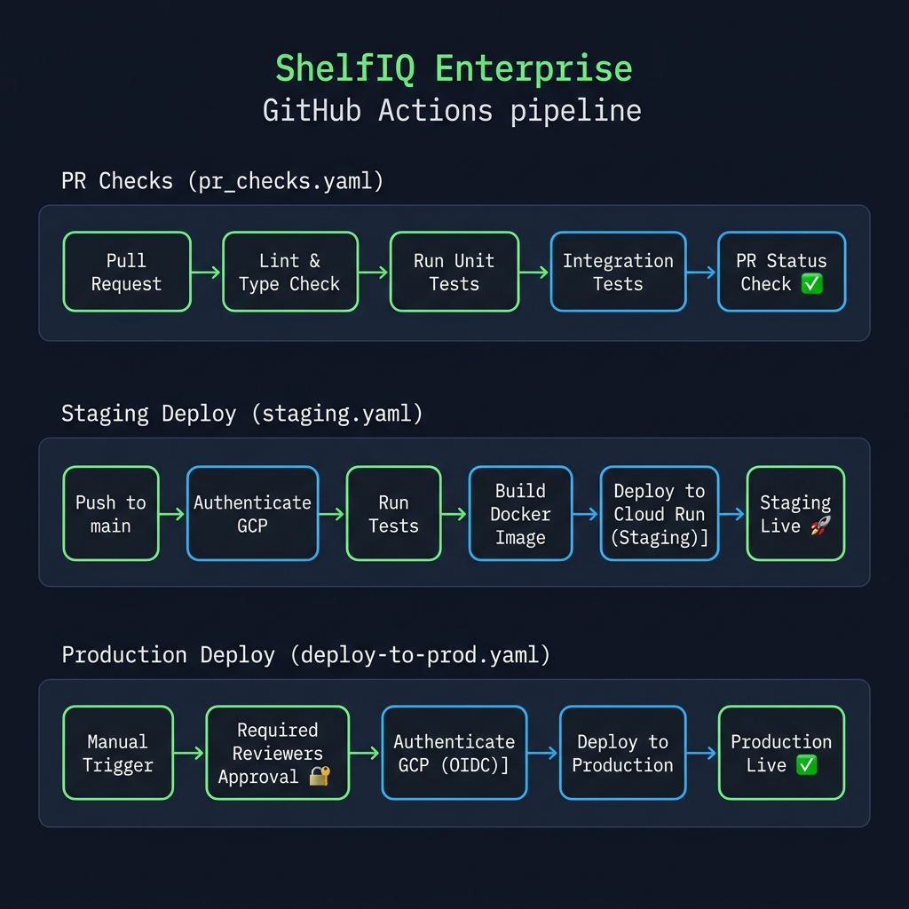

# ShelfIQ Enterprise

**AI-Powered Multi-Agent Inventory Intelligence Command Center for Modern Retail Operations.**

ShelfIQ Enterprise is a state-of-the-art inventory optimization and demand forecasting system. It acts as an autonomous Operations Team rather than a basic chatbot, helping retail stores reduce stockouts, optimize purchase orders, minimize holding costs, and automatically scope data by roles and store branches.

---

## Key Features

*   **Role-Based Access Control (RBAC)**: Secure user login system that controls what a user sees and can do based on their role and assigned branch.
*   **Store-Scoped Data views**: 
    *   *Sarah Miller (Store Manager)* & *Lisa Chen (Finance)* see only **STORE_A** (Downtown Grocery branch).
    *   *Mike Johnson (Warehouse Manager)* sees only **STORE_B** (North Warehouse branch).
    *   *Alex Admin (Admin)* gets a comprehensive **ALL STORES** consolidated command view.
*   **Premium Interactive Executive Dashboard**: Displays real-time Inventory Health Scores, Stockout Risk alerts, Overstock indicators, Potential Savings, and Estimated Revenue Recovery.
*   **Intelligent Auto-Recommendations**: Automatically calculated purchase quantities with supplier pricing comparison, lead-time weights, and savings estimators.
*   **Interactive PO Reorder Dialog**: Managers can specify exact custom order quantities, which are saved to the backend MySQL database with UTC time logs in `"reordered"` state.
*   **Order Verification & Approval**: Seamless approval pipeline that automatically updates inventory levels in real-time upon approval.
*   **Demand Forecasting Visualizer**: Advanced sales projections with XGBoost and seasonality trend graphs.

---

## System Workflows & Screenshots

### Dashboard Overview
Below is the modern glassmorphic Executive Dashboard showing high-priority alerts, financial tracking, and automated inventory recommendations:



### System Architecture
ShelfIQ is architected with a decoupled frontend and a multi-agent orchestrator backend hooked to a local MySQL server:



### Multi-Agent Collaboration Workflow
Our AI agents work in parallel to check stock, cross-reference supplier prices, forecast future sales, and prepare draft PO recommendations:



### Order & Stock Lifecycle
From initial critical warning flags to custom PO drafting, manager confirmation, database logging, and stock level incrementation:



---

## Architecture & Tech Stack

### Frontend
*   **React 18** with **TypeScript** & **Vite**
*   **Lucide React** icons
*   **Custom Vanilla CSS** implementing vibrant dark glassmorphic styling, responsive layout structures, and sleek transitions.

### Backend
*   **FastAPI** for high-performance REST APIs.
*   **SQLAlchemy ORM** + **PyMySQL** connection driver.
*   **Google GenAI SDK (ADK)** for agent reasoning.
*   **XGBoost** & **Statsmodels** for demand forecasting.

### Database
*   **MySQL (v8.0+)** for user validation, inventory logging, PO creation, and audit logging.
*   Auto-creation of the `shelfiq` database and automatic data seeding on FastAPI application startup.
*   **SQLite Fallback**: Automatically activates a local SQLite DB if a local MySQL instance is not detected.

---

## Database Schema (MySQL DDL)

The database schema consists of 6 primary tables:
1.  `users`: Stores email, role, and store scope.
2.  `inventory_items`: Scoped per store branch.
3.  `suppliers`: Scoped per store.
4.  `sales_records`: Holds 60 days of historical sales data for forecasting.
5.  `supplier_prices`: Pricing catalog for each supplier/product combination.
6.  `purchase_orders`: Tracks the date, time, quantity, and status (`reordered`, `approved`, `rejected`).
7.  `audit_logs`: Logs system events and changes.

---

## Installation & Setup

### 1. Backend Setup

Prerequisites:
*   Python 3.11+
*   **uv** (recommended Python package manager)
*   MySQL Server running on `localhost:3306` with credentials `root:102030` (or fallback to SQLite is triggered automatically).

Navigate to the project root:
```bash
# Install dependencies
uv sync

# Run the FastAPI server
uv run python app/fast_api_app.py
```
The backend server will run on `http://localhost:8000`.

### 2. Frontend Setup

Prerequisites:
*   Node.js v18+
*   npm

Navigate to the frontend directory:
```bash
cd frontend

# Install packages
npm install

# Start the Vite development server
npm run dev
```
The frontend will run on `http://localhost:5173`.

### 3. Demo Login Credentials

You can use the **Demo Accounts** panel on the login page to auto-fill these credentials:

*   **Admin**: `admin@shelfiq.com` | Password: `Admin@123`
*   **Store Manager (Downtown Grocery)**: `sarah@shelfiq.com` | Password: `Sarah@123`
*   **Warehouse Manager (North Warehouse)**: `mike@shelfiq.com` | Password: `Mike@123`
*   **Finance (Downtown Grocery)**: `lisa@shelfiq.com` | Password: `Lisa@123`

---

## GitHub Actions workflow (CI/CD)

The repository comes pre-packaged with a `.github/workflows/main.yml` CI/CD file to lint code and verify that the backend tests pass successfully.

---
Created and maintained by the **ShelfIQ Operations Team**.
